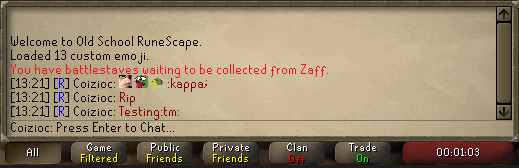
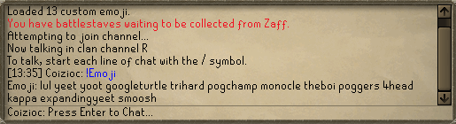

# Runelite Custom Emoji Plugin

## Usage

In order to use this plugin, you must first create a folder in `.runelite` 
called `customemoji`. the `.runelite` folder can be found in your home 
directory. In `customemoji`, you can insert `.png` or `.jpg` files whose
names correspond to the emoji's name.

*Note that this plugin will automatically resize the photos to 13x13 pixels 
in order to render them in game.*

In order to use the emoji in chat, you must type the emoji name in colons. For 
example, if we have the following file `yeet.png`:

We can type `:yeet:` to render it as shown in the image above. If an
emoji with the name within the colons is not found, it will simply 
render the raw text, as with `:tm:` in the above image.

There is also a command `!emoji` that allows you to see a list of the 
loaded emoji:

